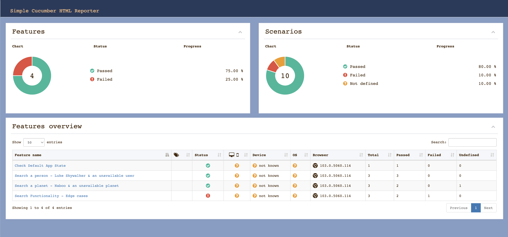

<h1 align="center">
  
  <br>
  
</h1>

# QA Engineer Assessment Solution
# **🚚 Fedex's QA Assessment**
# Solution By Name: Naveen Sabares B, India | +91 - 98417 46095
## **🪔 Introduction**
This test framework is enhanced as a part of QA assessment using Cucumber, JavaScript & TypeScript. Used the "protractor-cucumber-framework" package to write, configure & run tests. 
### **End to End testing suite using**
1. Cucumber https://cucumber.io/
2. JavaScript https://www.javascript.com/
3. TypeScript https://www.typescriptlang.org/
## **📁 Structure**
```sh
test
|- config # Global Configuration
|- content # Contains the static content of App
|- features # Here is the magic 🧙‍♂️ 
|- helpers # Locators📜 for the application & "protractor adapter" contains the functions to get selectors based on id/css/xpath etc & related functions
|- img # Contains the images/assets
|- steps # Here are the step definitions that are called in the feature files
|- utils # Utils used for assertions. Can be upgraded for API functions etc. 
|- test-reports # Added to .gitignore, contains the html/JUnit reports with playwright trace
|- test-results # Added to .gitignore, contains the failed test artifacts
```
## **🤖 Getting Started**
### **Pre-requisites**
    node - v16.15.0 (minimum requirement - v12+)
    protractor - v7.0.0
    protractor-cucumber-framework - 8.4.3
### **Dependency Installation**
#### The test dependencies are installed using the commands below
    npm i
    
    gulp update-test-drivers 
    
    (or) 
    
    npm run protractor-webdriver-manager-install
    npm run protractor-chromedriver-manager-update
    npm run chromedriver-update
## **🚀 Browsers Supported**
|          | Linux | macOS | Windows |
|   :---   | :---: | :---: | :---:   |
| Chrome <!-- GEN:chromium-version -->103.0.5060.24<!-- GEN:stop --> | :white_check_mark: | :white_check_mark: | :white_check_mark: |
## **🧰 About Protractor/Cucumber Capabilities**
### **File name:** *./protractor.conf.js*

* *baseUrl* - URL of the AUT; This is local host as the app is served locally.
* *cucumberOpts.require*  - Mention the step definitions mentioned in features.
* *plugins.options.reportPath*  - The path of HTML report generated by 'protractor-simple-cucumber-html-reporter-plugin'.
* *plugins.options.openReportInBrowser* - By default to be set to true; Opens the HTML report after execution.
* *plugins.options.removeExistingJsonReportFile* - By default to be set to true; Removed the .json test-result files of previous executions
## **🎬 Build and Test**
###  **🕹️ LOCAL RUN**
#### **🏠 Run protractor tests**
##### Below command serves the app locally in port 4200
    npm run start
##### Open a fresh terminal and execute the test by running the below command
    protractor
    
## 🎯 Features tested

### Search for character (person)
*	When you search for **a character** and it’s a valid one, then you should be able to see his / her “Gender”, “Birth year”, “Eye color” and “Skin color”. - ***PASSED***
*	When you search for a character and it’s not a valid one, then you should be able to see “Not found” in the results. - ***PASSED***

### Search for planet
*	When you search for **a planet** and it’s a valid one, then you should be able to see its “Population”, “Climate” and “Gravity”. - ***PASSED***
*	When you search for a planet and it’s not a valid one, then you should be able to see “Not found” in the results. - ***PASSED***

### Additional flows
*	When you search for either a character or a planet and you get one or more results for it, clear the “Search form” and hit the Search button again, you should then get an empty result list (previous search results are removed). - ***FAILED***
*	You can search for results by clicking the “Search” button or by pressing “enter” on the search field. - ***PASSED***
*	When for example you have searched for a full planet name and you’ve got results, if you switch to People and search for the same thing (that has no matching people based on a partial name), you should get a “Not found” in the results. - ***PASSED***
*	You can have more than one results, for both Planets and Names (partial matching). - ***PASSED***

## ✅ ❌ Sample PROTRACTOR CUCUMBER HTML REPORT

<h1 align="left">
  
</h1>

## 👨‍💻 Add-on

### Added a cool "Darth Vader" 🌌🔫 Back-ground image to the app as a Separate Component. 

## ***⚡🧙May the Force Be with You.....***